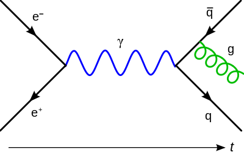
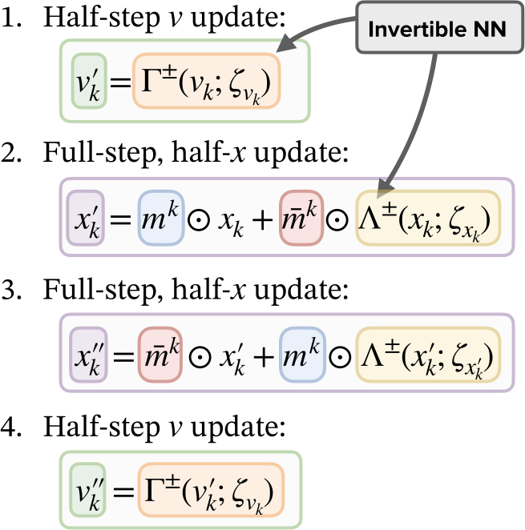
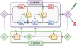
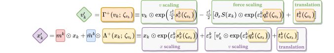
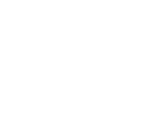
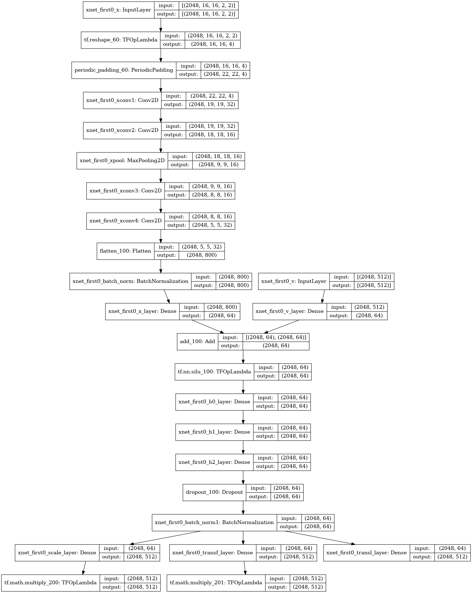

<!-- .slide: data-background="#1c1c1c" -->

&nbsp;

### Accelerated Sampling Techniques
#### in Lattice Gauge Theory

[BNL &amp; RBRC: "DWQ @ 25"](https://indico.bnl.gov/event/13576/)
 
December, 2021
 
 

[**Sam Foreman**](https://www.samforeman.me)

 

<small>[1] [arXiv: 2105.03418](https://arxiv.org/abs/2105.03418), 
   [2] [arXiv: 2112.01582](https://arxiv.org/abs/2112.01582)
 [3] [arXiv: 2112.01586](https://arxiv.org/abs/2112.01586)</small>
</small>

<!--
# Introduction

- **Standard Model:**
    - E&amp;M, strong, weak interactions, elementary particles

- **Quantum Chromodynamics (QCD)**:
	- Theory of the strong interaction between quarks and gluons
	- **Analytically intractable**
        - Discretize space-time onto lattice

 

-->

---
<!-- .slide: data-background="#1c1c1c" -->

## Motivation

- Want to calculate observables
  $$ \langle \mathcal{O}\rangle\propto\int\left[\mathcal{D}x\right]\mathcal{O}(x)e^{-S(x)} $$
- If we had _independent configurations_, we could approximate the integral as
  $$ \langle\mathcal{O}\rangle\simeq\frac{1}{N}\sum_{n=1}^{N}\mathcal{O}(x_{n})\Rightarrow \sigma^{2}=\frac{1}{N}\text{Var}\left[\mathcal{O}(x)\right] $$

---
<!-- .slide: data-background="#1c1c1c" -->

## Motivation

- For independent samples: 
  $$\langle \mathcal{O}\rangle \propto\int\left[\mathcal{D}x\right]\mathcal{O}(x)e^{-S(x)}
  \simeq\frac{1}{N}\sum_{n=1}^{N}\mathcal{O}(x_{n})$$
  $$\Rightarrow \sigma^{2}=\frac{1}{N}\text{Var}\left[\mathcal{O}(x\right)]$$
- Accounting for autocorrelations:
  $$ \sigma^{2}=\frac{\color{#228BE6}{\tau_{\mathrm{int}}^{\mathcal{O}}}}{N}\text{Var}\left[\mathcal{O}(x)\right] $$
- $\tau_{\mathrm{int}}^{\mathcal{O}}$ is known to scale exponentially as we approach physical lattice spacing.

---
<!-- .slide: data-background="#1c1c1c" -->

## Motivation

<!-- - The ability to efficiently sample from complicated sampling from complicated distributions is a widely studied  -->
- Generating independent configurations is currently a major bottleneck for
  lattice QCD.

- As the lattice spacing $a\rightarrow 0$ (or equivalently, $\beta \rightarrow \infty$),
  configurations get stuck in sectors of fixed gauge topology. 

  - Causes $\tau_{\mathrm{int}}$ to grow exponentially

  

---

# Critical Slowing Down

- Generating independent configurations is currently a major bottleneck for lattice QCD.

- As $\beta\rightarrow \infty$, configurations get stuck in sectors of fixed gauge topology $Q = \text{ const. }$ 

  - $\Rightarrow$ \# of configurations required to reliably estimate errors **increases exponentially** 
  - $\tau_{\mathrm{int}} \rightarrow \infty$

---
<!-- .slide: data-background="#1c1c1c" -->

### HMC: Leapfrog Integrator

  <!-- .element width="70%" -->

<iframe data-src="https://chi-feng.github.io/mcmc-demo/app.html"></iframe> <!-- .element width="95%" height="300px" -->

---

# Issues with HMC
	
- Energy levels selected randomly $\rightarrow$ slow mixing!
- Cannot easily traverse low-density zones
- What do we want in a good sampler?
  - **Fast mixing** (small autocorrelations) 
  - **Fast burn-in** (quick convergence)
  - Ability to mix across energy levels and isolated modes

 <!-- .element width="49%" -->
 <!-- .element width="49%" -->

---

# Leapfrog Layer

- <b><u>L2HMC Update</u></b>:

  

&nbsp;

 <!-- .element width="55%" align="center" -->

---
<!-- .slide: data-background="#1c1c1c" -->

## Leapfrog Layer

### <u>L2HMC Update</u>:
1. Update $\mathbf{v}$:

    - `\(\mathbf{v}'= \Gamma^{\pm}[\mathbf{v}; \zeta_{\mathbf{v}}]\)`

2. Update half of `\(\mathbf{x}\)` via  `\(\mathbf{x}_{\bar{m}}\)`:

    - `\(\mathbf{x}' = \)` `\(\mathbf{x}_{m} \)``\(+ \Lambda^{\pm}[\)``\(\mathbf{x}_{\bar{m}}\)``\(; \zeta_{\mathbf{x}}]\)`

3. Update (other) half of `\(\mathbf{x}\)` via  `\(\mathbf{x}_{k}'\)` :

    - `\(\mathbf{x}'' = \)` `\(\mathbf{x}_{\bar{m}} \)``\(+ \Lambda^{\pm}[\)``\(\mathbf{x}_{m}'\)``\(; \zeta_{\mathbf{x}'}]\)`

4. Update $\mathbf{v}$:

    - `\(\mathbf{v}''= \Gamma^{\pm}[\mathbf{v}'; \zeta_{\mathbf{v}'}]\)`

 

 <!-- .element width="58%" -->
 <!-- .element width="100%" align="center" -->

---

## Toy Example: GMM $\in \mathbb{R}^{2}$

---

# Lattice Gauge Theory
	

- <b>Link variables</b>: 
  $\color{#228BE6}{U_{\mu}(x) = e^{i x_{\mu}(n)}\in U(1)}$

  with $x_{\mu}(n)\in[-\pi,\pi]$

- <b>Wilson Action</b>: $\color{#228BE6}{S_{\beta}(x) = \beta\sum_{P} 1 - \cos x_{P}}$,
	
  $x_{P}= x_{\mu}(n) + x_{\nu}(n+\hat{\mu})-x_{\mu}(n+\hat{\nu})-x_{\nu}(n)$
	

	

 <!-- .element align="right" width="70%" -->

- <b>Topological Charge</b>:

  ✅ $Q_{\mathbb{R}} = \frac{1}{2\pi}\sum_{P} \sin x_{P}\in\mathbb{R}$  

  ❌ $Q_{\mathbb{Z}} = \frac{1}{2\pi}\sum_{P} \left\lfloor x_{P}\right\rfloor\in\mathbb{Z}$ 
	
  here $\left\lfloor x_{P}\right\rfloor = x_{P}-2\pi\left\lfloor\frac{x_{P}+\pi}{2\pi}\right\rfloor$

---
### Integrated Autocorrelation Time: $\tau_{\mathrm{int}}$
 <!-- .element width="50%" -->
 <!-- .element width="90%" -->
	  
---

# Interpretation

 

<b>(a.)</b> Deviation in the average plaquette ; 
<b>(b.)</b> Real-valued topological charge ; 
<b>(c.)</b> Effective energy ;

 
<b>Fig.</b> Illustration of how different observables evolve over a
single L2HMC trajectory.
</small>

---

<!-- .slide: data-background="#1c1c1c" -->

#  [l2hmc-qcd](https://github.com/saforem2/l2hmc-qcd)

- [arXiV:2105.03418](https://arxiv.org/abs/2105.03418)

- Source code publicly available

- Both `pytorch` and `tensorflow` implementations with support for distributed training, automatic checkpointing, etc.

- Generic interface, easily extensible

- <b>Work in progress</b> scaling up to 2D, 4D $SU(3)$

---

## Non-Compact Projection 
<small>[arXiv:2002.02428](https://arxiv.org/abs/2002.02428)</small>

- Project $x \in[-\pi, \pi]$ onto $\mathbb{R}$ using a transformation $z = g(x)$:
  $$ z = \tan\left(\frac{x}{2}\right) $$
- Perform the update in $\mathbb{R}$:
  $$ z' = m^{t}\odot z + \bar{m}^{t}\odot \left[\alpha z + \beta\right]$$
- Project back to $[-\pi, \pi]$ using $x = g^{-1}(z)$:
  $$ x = 2 \tan^{-1}(z) $$

---

# Non-Compact Projection

- Combine into a single update:
  $$ x' = \color{#228BE6}{m^{t}}\odot x +
  \color{#FA5252}{\bar{m}^{t}}\odot\left[2\tan^{-1}\left(\alpha\tan\left(\frac{x}{2}\right)\right)+\beta\right]
  $$
- With corresponding Jacobian:
  $$ \frac{\partial x'}{\partial x} = \frac{\exp(\varepsilon s_{x})}{\cos^{2}(x/2)+exp(2\varepsilon s_{x})\sin(x/2)} $$

---

## Acknowledgements

### Collaborators:
 - Xiao-Yong Jin
 - James C. Osborn

### References:
 - [Link to slides](https://bit.ly/l2hmc-ect2021)
 - [Link to github](https://github.com/saforem2/l2hmc-qcd)
 - [reach out!](mailto://foremans@anl.gov)
 - [Link to HMC demo](https://chi-feng.github.io/mcmc-demo/app.html)
 - [arXiv:2105.03418](https://arxiv.org/abs/2002.02428)
 - [arXiv:2002.02428](https://arxiv.org/abs/2002.02428)

### Huge thank you to:
 - Yannick Meurice
 - Norman Christ
 - Akio Tomiya
 - Luchang Jin
 - Chulwoo Jung
 - Peter Boyle
 - Taku Izubuchi
 - Critical Slowing Down group (ECP)
 - ALCF Staff + Datascience Group

<small> 
This research used resources of the Argonne Leadership Computing Facility,
which is a DOE Office of Science User Facility supported under Contract
DE-AC02-06CH11357.
</small>

---

### Network Architectures

---

### Network Architectures

---

