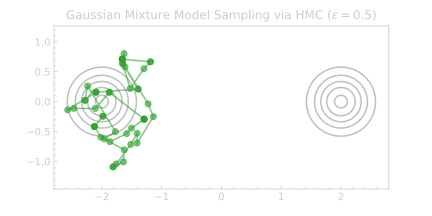
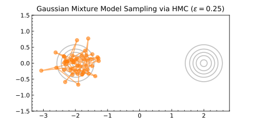
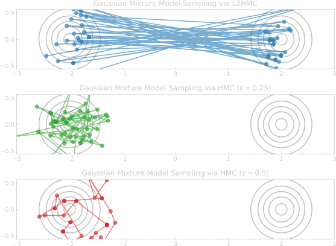
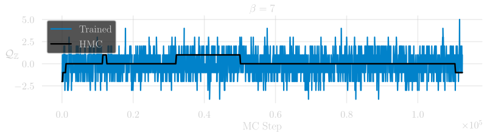
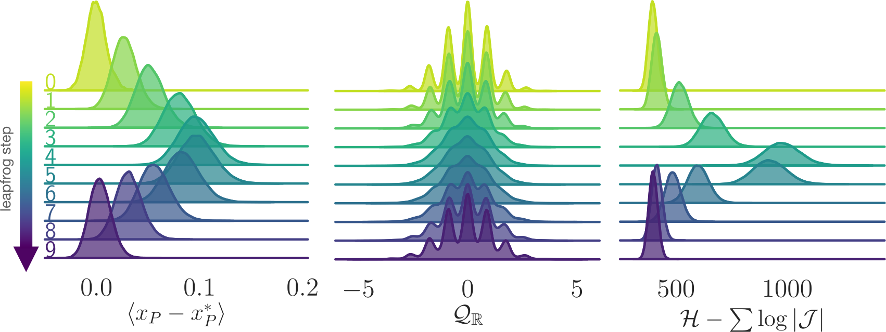

<!-- .slide: data-background="#1c1c1c" -->

<h1 class="r-fit-text">Accelerated Sampling Techniques</h1>

<h3>for Lattice Gauge Theory</h3>

[BNL &amp; RBRC: "DWQ @ 25"](https://indico.bnl.gov/event/13576/)

December, 2021

 

#### [**Sam Foreman**](https://www.samforeman.me)

 

<small><a href="https://arxiv.org/abs/2105.03418">arXiv: 2105.03418</a>
$\hspace{10pt}$
<a href="https://arxiv.org/abs/2112.01582">arXiv: 2112.01582</a>
$\hspace{10pt}$
<a href="https://arxiv.org/abs/2112.01586">arXiv: 2112.01586</a></small>

---
<!-- .slide: data-background="#1c1c1c"-->

# Motivation

- Want to calculate observables

  $$ \langle \mathcal{O}\rangle\propto\int\left[\mathcal{D}x\right]\mathcal{O}(x)e^{-S(x)} $$

- If we had _independent configurations_, we could approximate the integral as
  $$ \langle\mathcal{O}\rangle\simeq\frac{1}{N}\sum_{n=1}^{N}\mathcal{O}(x_{n})\Rightarrow \sigma^{2}=\frac{1}{N}\text{Var}\left[\mathcal{O}(x)\right] $$

---
<!-- .slide: data-background="#1c1c1c" -->

# Motivation

- For independent samples: 
  $$\langle \mathcal{O}\rangle \propto\int\left[\mathcal{D}x\right]\mathcal{O}(x)e^{-S(x)}
  \simeq\frac{1}{N}\sum_{n=1}^{N}\mathcal{O}(x_{n})$$
  $$\Rightarrow \sigma^{2}=\frac{1}{N}\text{Var}\left[\mathcal{O}(x\right)]$$
- Accounting for autocorrelations:
  $$ \sigma^{2}=\frac{\color{#228BE6}{\tau_{\mathrm{int}}^{\mathcal{O}}}}{N}\text{Var}\left[\mathcal{O}(x)\right] $$
- $\tau_{\mathrm{int}}^{\mathcal{O}}$ is known to scale exponentially as we approach physical lattice spacing.

---
<!-- .slide: data-background="#1c1c1c" -->

# Motivation

<!-- - The ability to efficiently sample from complicated sampling from complicated distributions is a widely studied  -->
- Generating independent configurations is currently a major bottleneck for
  lattice QCD.

- As the lattice spacing $a\rightarrow 0$ (or equivalently, $\beta \rightarrow \infty$),
  configurations get stuck in sectors of fixed gauge topology. 

  - Causes $\tau_{\mathrm{int}}$ to grow exponentially

  

---
<!-- .slide: data-background="#1c1c1c" -->

# Critical Slowing Down

<h6>Charge Freezing</h6>

- $Q$ gets stuck!

- $Q \longrightarrow \text{ const.}$
    as  $\beta\longrightarrow \infty$

  - \# configs required to estimate errors **grows exponentially** $\Longrightarrow$

    $\tau_{\mathrm{int}}^{Q} \longrightarrow \infty$ 

  

---
<!-- .slide: data-background="#1c1c1c" -->

## HMC: Leapfrog Integrator

  <!-- .element width="90%" -->

<iframe data-src="https://chi-feng.github.io/mcmc-demo/app.html"></iframe> <!-- .element width="80%" -->

---
<!-- .slide: data-background="#1c1c1c" -->

# Issues with HMC
	
- Energy levels selected randomly $\rightarrow$ slow mixing!
- Cannot easily traverse low-density zones
- What do we want in a good sampler?
  - **Fast mixing** (small autocorrelations) 
  - **Fast burn-in** (quick convergence)
  - Ability to mix across energy levels and isolated modes

 <!-- .element width="49%" -->
 <!-- .element width="49%" -->

---
<!-- .slide: data-background="#1c1c1c" -->

## Toy Example: GMM $\in \mathbb{R}^{2}$

<!-- .slide: data-background="#1c1c1c" -->
<!--

## Leapfrog Layer

#### <u>L2HMC Update:</u>
1. Update $\mathbf{v}$:

    - `\(\mathbf{v}'= \Gamma^{\pm}[\mathbf{v}; \zeta_{\mathbf{v}}]\)`

2. Update half of `\(\mathbf{x}\)` via  `\(\mathbf{x}_{\bar{m}}\)`:

    - `\(\mathbf{x}' = \)` `\(\mathbf{x}_{m} \)``\(+ \Lambda^{\pm}[\)``\(\mathbf{x}_{\bar{m}}\)``\(; \zeta_{\mathbf{x}}]\)`

3. Update (other) half of `\(\mathbf{x}\)` via  `\(\mathbf{x}_{m}'\)` :

    - `\(\mathbf{x}'' = \)` `\(\mathbf{x}_{\bar{m}} \)``\(+ \Lambda^{\pm}[\)``\(\mathbf{x}_{m}'\)``\(; \zeta_{\mathbf{x}'}]\)`

4. Update $\mathbf{v}$:

    - `\(\mathbf{v}''= \Gamma^{\pm}[\mathbf{v}'; \zeta_{\mathbf{v}'}]\)`

 

 
.element width="60%" 
 
.element width="100%" align="center" 

 -->

---
<!-- .slide: data-background="#1c1c1c" -->

<h2> L2HMC Update </h2>

---
<!-- .slide: data-background="#1c1c1c" -->

## Training Step

1. Resample $\mathbf{v} \sim \mathcal{N}(0, \mathbb{1})$, $d\sim\mathcal{U}(+, -)$, 
   construct $\xi = (\mathbf{x}, \mathbf{v}, \pm)$

2. Generate proposal $\xi^{\ast}$ by passing initial
   $\xi$ through $N_{\mathrm{LF}}$ **leapfrog
   layers**:

   

   $\xi$ $ \hspace{1pt}\xrightarrow[]{\tiny{\mathrm{LF} \text{ layer}}}\xi_{1} \longrightarrow\cdots \longrightarrow \xi_{N_{\mathrm{LF}}} =$ $\xi^{\ast}$

   

3. Compute the **Metropolis-Hastings** (MH) acceptance (with Jacobian
   $\mathcal{J}$) 

   

   $A(\color{#AE81FF}{\xi^{\ast}}|\color{#00CCFF}{\xi})=
   \mathrm{min}\left\\{1,
   \frac{p(\color{#AE81FF}{\xi^{\ast}})}{p(\color{#00CCFF}{\xi})}\mathcal{J}\left(\color{#AE81FF}{\xi^{\ast}},\color{#00CCFF}{\xi}\right)\right\\}$

   

4. Evaluate the **loss function** $\mathcal{L}\gets
   \mathcal{L}_{\theta}(\color{#AE81FF}{\xi^{\ast}}, \color{#00CCFF}{\xi})$ and backpropagate gradients

5. Evaluate MH criteria and assign the next state in the chain according to

   

   $\mathbf{x}_{i+1}\gets
   \begin{cases}
     \color{#AE81FF}{\mathbf{x}^{\ast}} \small{\text{ w/ prob }} A(\color{#AE81FF}{\xi^{\ast}}|\color{#00CCFF}{\xi}) \hspace{25pt}✅ \\\\
     \color{#00CCFF}{\mathbf{x}} \hspace{14px}\small{\text{ w/ prob }} 1 - A(\color{#AE81FF}{\xi^{\ast}}|\color{#00CCFF}{\xi}) \hspace{11pt}❌
     \end{cases}$

   

---
<!-- .slide: data-background="#1c1c1c" -->

### Lattice Gauge Theory

- <h5><b><u> Link variables</u></b></h5>
   $U_{\mu}(x) = e^{i x_{\mu}(n)}\in U(1)$,

   with $x_{\mu}(n)\in[-\pi,\pi]$

- <h5><b><u> Wilson Action</u></b></h5>

   $S_{\beta}(x)
  = \beta\sum_{P} 1 - \cos x_{P}$

  $x_{P}= x_{\mu}(n) + x_{\nu}(n+\hat{\mu})-x_{\mu}(n+\hat{\nu})-x_{\nu}(n)$

- <h5><b><u> Topological Charge</U></b></h5>

  <!-- .element align="center" width="90%"-->

**Continuous:** $\hspace{2pt}$ ✅ $Q_{\mathbb{R}} = \frac{1}{2\pi}\sum_{P} \sin x_{P}\in\mathbb{R}$ 

$\hspace{10pt}$  **Discrete:**$\hspace{4pt}$ ❌ $Q_{\mathbb{Z}} = \frac{1}{2\pi}\sum_{P} \left\lfloor x_{P}\right\rfloor\hspace{18px}\in\mathbb{Z}$

  $\hspace{45pt}$ with $\left\lfloor x_{P}\right\rfloor = x_{P}-2\pi\left\lfloor\frac{x_{P}+\pi}{2\pi}\right\rfloor$

  <!-- ✅ $Q_{\mathbb{R}} = \frac{1}{2\pi}\sum_{P} \sin x_{P}\in\mathbb{R}$  -->

  <!-- ❌ $Q_{\mathbb{Z}} = \frac{1}{2\pi}\sum_{P} \left\lfloor x_{P}\right\rfloor\hspace{18px}\in\mathbb{Z}$ -->

---
<!-- .slide: data-background="#1c1c1c" -->

## Loss Function

- Maximize the _expected squared charge difference_ :
  

  \[\begin{equation}
  \mathcal{L}(\theta) = \color{#228BE6}{\mathbb{E}_{p(\xi)}}
  \left[-\color{#FA5252}{{\delta Q}}^{2}_{\color{#FA5252}{\mathbb{R}}}(\xi', \xi)\cdot
  A(\xi'|\xi)\right]
  \end{equation}\]
  

- Where $\color{#FA5252}{\delta Q_{\mathbb{R}}}$ is the tunneling rate
  $$\color{#FA5252}{\delta Q_{\mathbb{R}}}(\xi',\xi)=\left|Q_{\mathbb{R}}(x') - Q_{\mathbb{R}}(x)\right|$$
- And $A(\xi'|\xi)$ is probability of accepting the proposal configuration $\xi'$.
  $$ A(\xi'|\xi) = \min\left(1, \frac{p(\xi')}{p(\xi)}\left|\frac{\partial \xi'}{\partial \xi^{T}}\right|\right\)$$

---
<!-- .slide: data-background="#1c1c1c" -->

#### Integrated Autocorrelation time: $\tau_{\mathrm{int}}$

We can measure the performance by comparing $\tau_{\mathrm{int}}^{Q}$ for the
**trained model** to **HMC**.

---
<!-- .slide: data-background="#1c1c1c" -->

### Integrated Autocorrelation Time

Comparison of $\tau_{\mathrm{int}}^{Q}$ for **trained models**  vs **HMC**  with different trajectory lengths,
$N_{\mathrm{LF}}$, at $\beta = 4, 5, 6, 7$

---

<!-- .slide: data-background="#1c1c1c" -->

# Interpretation

$\hspace{32pt}$
Deviation in $x_{P}\hspace{20pt}$
$\hspace{10pt}$ Topological charge mixing
$\hspace{20pt}$ Artificial influx of energy

Illustration of how different observables evolve over a
single L2HMC trajectory.

---
<!-- .slide: data-background="#1c1c1c" -->

## Interpretation

 <!-- .element width="48%" align="center" -->
  <!-- .element width="48%" align="center" -->

Average plaquette $\langle x_{P}\rangle$ vs lf step

Average energy $H - \sum\log|\mathcal{J}|$

<small><b>Fig.</b> Illustration of how the trained model artificially
increases the energy towards the middle of the trajectory, allowing the sampler
to tunnel between isolated sectors.

---
<!-- .slide: data-background="#1c1c1c" -->

## Plaquette analysis: $x_{P}$

 <!-- .element width="100%" -->

Deviation from $V\rightarrow\infty$ limit:  $x_{P}^{\ast}$

Average $\langle x_{P}\rangle$, with $x_{P}^{\ast}$ (dotted-lines)

<small><b>Fig.</b> Plot showing how <b>average plaquette</b>, $x_{P}$ varies over a single trajectory</small>

---
<!-- .slide: data-background="#1c1c1c" -->

#  [l2hmc-qcd](https://github.com/saforem2/l2hmc-qcd)

- [arXiv: 2105.03418](https://arxiv.org/abs/2105.03418)
- [arXiv: 2112.01582](https://arxiv.org/abs/2112.01582)
- [arXiv: 2112.01586](https://arxiv.org/abs/2112.01586)

- Source code publicly available

- Both `pytorch` and `tensorflow` implementations with support for distributed training, automatic checkpointing, etc.

- Generic interface, easily extensible

- <b>Work in progress</b> scaling up to 2D, 4D $SU(3)$

---
<!-- .slide: data-background="#1c1c1c" -->

## Non-Compact Projection 
<small>[arXiv:2002.02428](https://arxiv.org/abs/2002.02428)</small>

- Project $x \in[-\pi, \pi]$ onto $\mathbb{R}$ using a transformation $z = g(x)$:
  $$ z = \tan\left(\frac{x}{2}\right) $$
- Perform the update in $\mathbb{R}$:
  $$ z' = m^{t}\odot z + \bar{m}^{t}\odot \left[\alpha z + \beta\right]$$
- Project back to $[-\pi, \pi]$ using $x = g^{-1}(z)$:
  $$ x = 2 \tan^{-1}(z) $$

---
<!-- .slide: data-background="#1c1c1c" -->

## Non-Compact Projection
<small>[arXiv:2002.02428](https://arxiv.org/abs/2002.02428)</small>

- Combine into a single update:
  $$ x' = \color{#228BE6}{m^{t}}\odot x +
  \color{#FA5252}{\bar{m}^{t}}\odot\left[2\tan^{-1}\left(\alpha\tan\left(\frac{x}{2}\right)\right)+\beta\right]
  $$
- With corresponding Jacobian:
  $$ \frac{\partial x'}{\partial x} = \frac{\exp(\varepsilon s_{x})}{\cos^{2}(x/2)+exp(2\varepsilon s_{x})\sin(x/2)} $$

---
<!-- .slide: data-background="#1c1c1c" -->

## Acknowledgements

### Collaborators:
 - Xiao-Yong Jin
 - James C. Osborn

### References:
 - [Link to slides](https://bit.ly/l2hmc-ect2021)
 - [Link to github](https://github.com/saforem2/l2hmc-qcd)
 - [reach out!](mailto://foremans@anl.gov)
 - [Link to HMC demo](https://chi-feng.github.io/mcmc-demo/app.html)
 - [arXiv:2105.03418](https://arxiv.org/abs/2002.02428)
 - [arXiv:2002.02428](https://arxiv.org/abs/2002.02428)

### Huge thank you to:
 - Yannick Meurice
 - Norman Christ
 - Akio Tomiya
 - Luchang Jin
 - Chulwoo Jung
 - Peter Boyle
 - Taku Izubuchi
 - ECP-CSD group
 - ALCF Staff + Datascience Group

<small> 

 

This research used resources of the Argonne Leadership Computing Facility,
which is a DOE Office of Science User Facility supported under Contract
DE-AC02-06CH11357.

</small>

